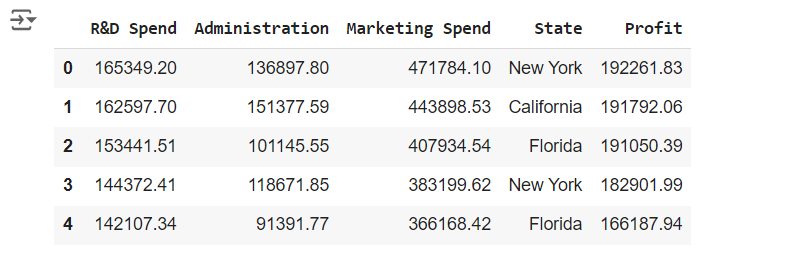
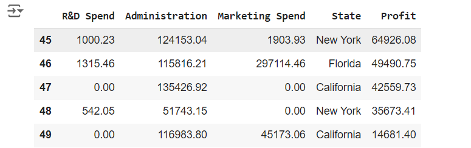
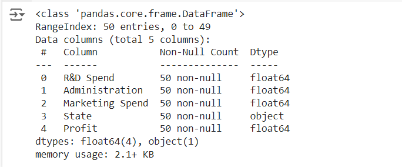
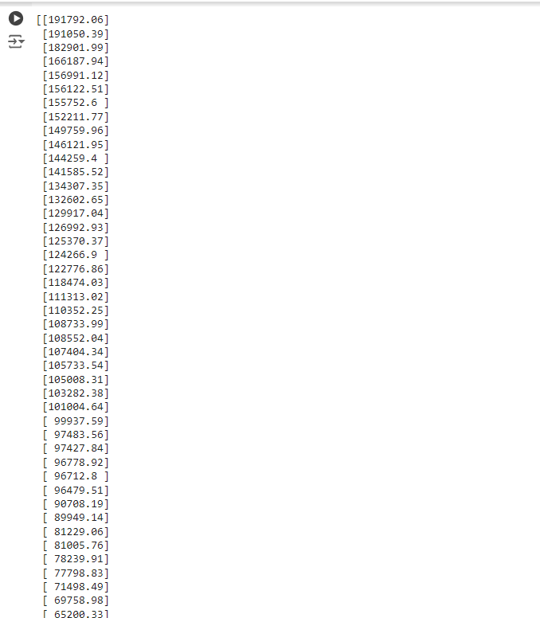
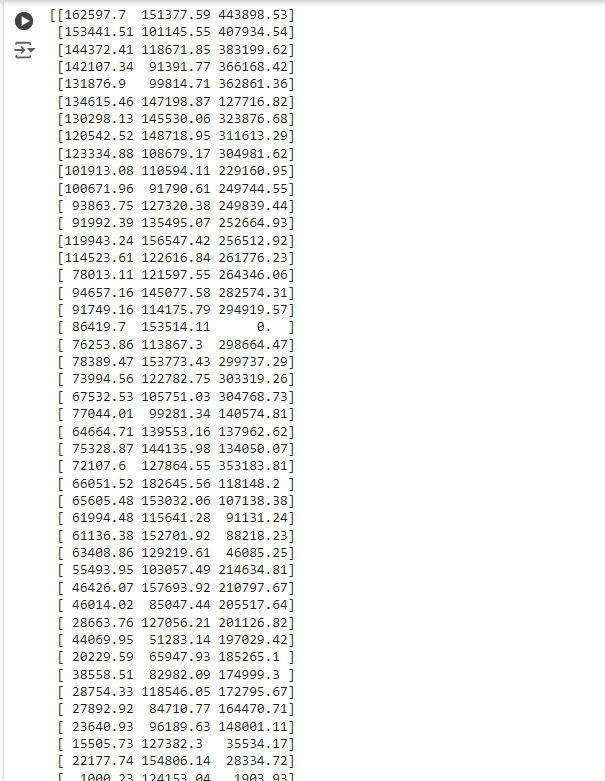
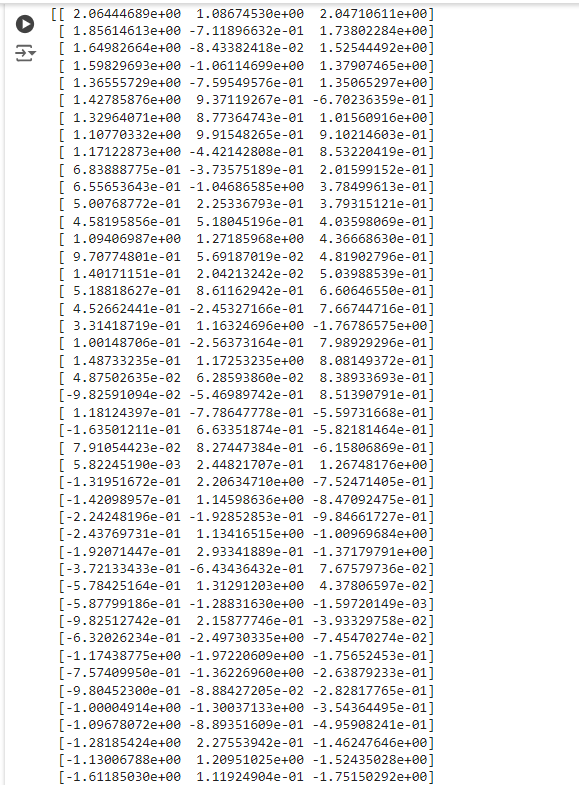
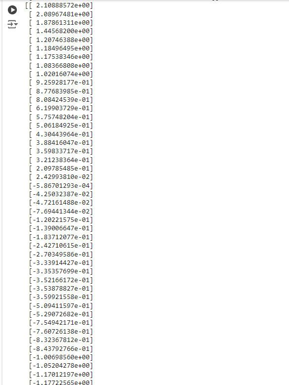

# Implementation-of-Linear-Regression-Using-Gradient-Descent

## AIM:
To write a program to predict the profit of a city using the linear regression model with gradient descent.

## Equipments Required:
1. Hardware – PCs
2. Anaconda – Python 3.7 Installation / Jupyter notebook

## Algorithm
1. Import necessary libraries such as NumPy, Pandas, Matplotlib, and metrics from sklearn.
2. Load the dataset into a Pandas DataFrame and preview it using head() and tail().
3. Extract the independent variable X and dependent variable Y from the dataset.
4. Initialize the slope m and intercept c to zero. Set the learning rate L and define the number of epochs.
5. Plot the error against the number of epochs to visualize the convergence.
6. Display the final values of m and c, and the error plot.

## Program:
```
/*
Program to implement the linear regression using gradient descent.
Developed by: JAYASREE R
RegisterNumber: 212223230087 
*/
```

## Output:

```
import numpy as np
import pandas as pd
from sklearn.metrics import  mean_absolute_error,mean_squared_error
import matplotlib.pyplot as plt
```
```
df=pd.read_csv("50_Startups.csv")
df.head()
```


```
df.tail()
```


```
df.info()
```


```
x=(df.iloc[1:,:-2].values)
y=(df.iloc[1:,-1].values).reshape(-1,1)
```
```
print(y)
```


```
print(x)
```


```
from sklearn.preprocessing import StandardScaler
scaler=StandardScaler()
x1_scaled=scaler.fit_transform(x)
y1_scaled=scaler.fit_transform(y)
```
```
print(x1_scaled)
print(y1_scaled)
```



```
def linear_regression(X1,y,learning_rate = 0.01, num_iters = 100):
    X = np.c_[np.ones(len(X1)),X1]
    theta = np.zeros(X.shape[1]).reshape(-1,1)
    for _ in range(num_iters):
        predictions = (X).dot(theta).reshape(-1,1)
        
        #calculate errors
        errors=(predictions - y ).reshape(-1,1)
        
        #update theta using gradiant descent
        theta -= learning_rate*(1/len(X1))*X.T.dot(errors)
    return theta

```
```
theta=linear_regression(X1_Scaled,Y1_Scaled)
```
```
new_data=np.array([165349.2,136897.8,471784.1]).reshape(-1,1)
new_Scaled=scaler.fit_transform(new_data)
prediction=np.dot(np.append(1,new_Scaled),theta)
prediction=prediction.reshape(-1,1)
pre=scaler.inverse_transform(prediction)
```
```
print(prediction)
print(f"Predicted value: {pre}")
```


## Result:
Thus the program to implement the linear regression using gradient descent is written and verified using python programming.
