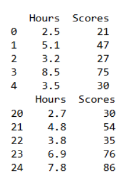
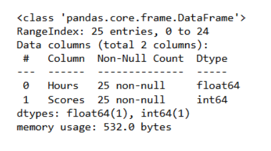
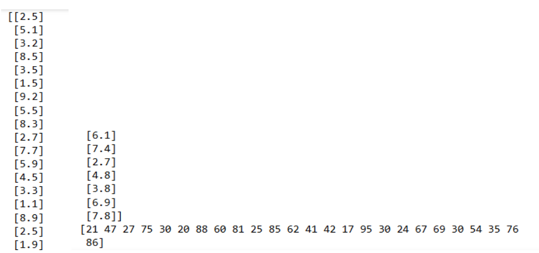
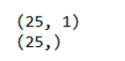
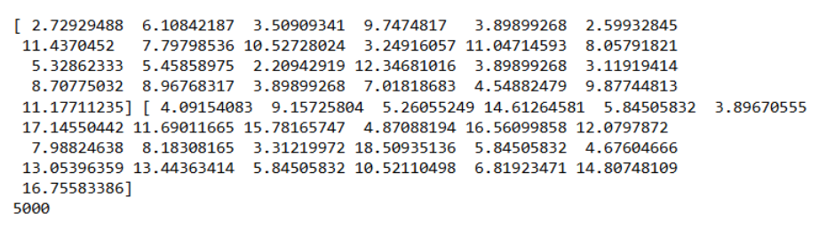
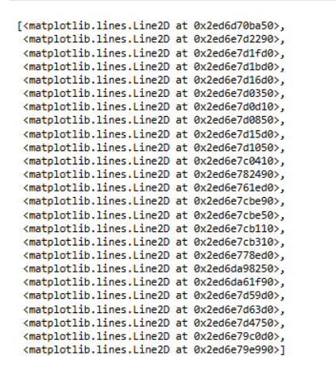
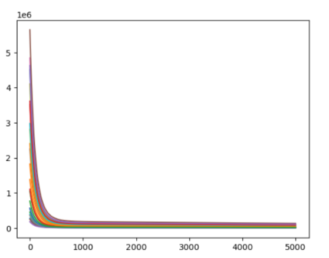

# Implementation-of-Linear-Regression-Using-Gradient-Descent

## AIM:
To write a program to predict the profit of a city using the linear regression model with gradient descent.

## Equipments Required:
1. Hardware – PCs
2. Anaconda – Python 3.7 Installation / Jupyter notebook

## Algorithm
1. Import necessary libraries such as NumPy, Pandas, Matplotlib, and metrics from sklearn.
2. Load the dataset into a Pandas DataFrame and preview it using head() and tail().
3. Extract the independent variable X and dependent variable Y from the dataset.
4. Initialize the slope m and intercept c to zero. Set the learning rate L and define the number of epochs.
5. Plot the error against the number of epochs to visualize the convergence.
6. Display the final values of m and c, and the error plot.

## Program:
```
/*
Program to implement the linear regression using gradient descent.
Developed by: JAYASREE R
RegisterNumber: 212223230087 
*/
```

## Output:

```
import numpy as np
import pandas as pd
from sklearn.metrics import  mean_absolute_error,mean_squared_error
import matplotlib.pyplot as plt
```
```
dataset = pd.read_csv('student_scores.csv')
print(dataset.head())
print(dataset.tail())
```


```
dataset.info()
```


```
X=dataset.iloc[:,:-1].values
print(X)
Y=dataset.iloc[:,-1].values
print(Y)
```


```
print(X.shape)
print(Y.shape)
```


```
m=0
c=0
L=0.0001
epochs=5000
n=float(len(X))
error=[]
for i in range(epochs):
    Y_pred = m*X +c
    D_m=(-2/n)*sum(X *(Y-Y_pred))
    D_c=(-2/n)*sum(Y -Y_pred)
    m=m-L*D_m
    c=c-L*D_c
    error.append(sum(Y-Y_pred)**2)
print(m,c)
type(error)
print(len(error))
```


```
plt.plot(range(0,epochs),error)
```





## Result:
Thus the program to implement the linear regression using gradient descent is written and verified using python programming.
